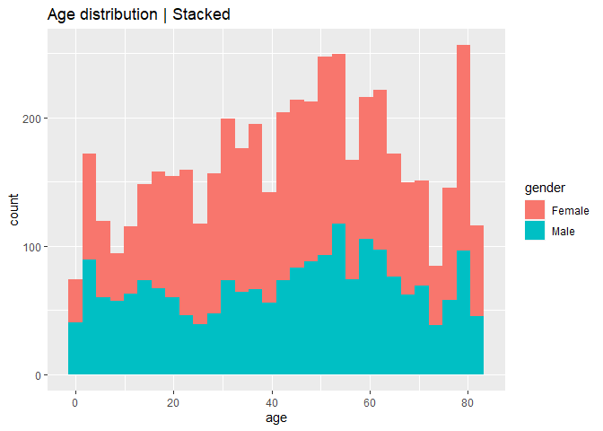
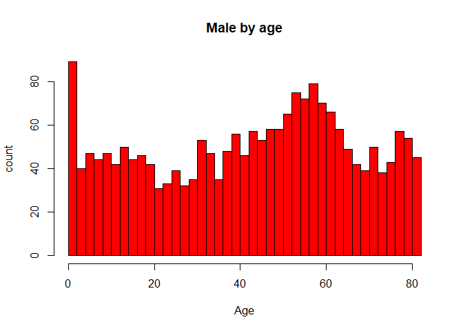
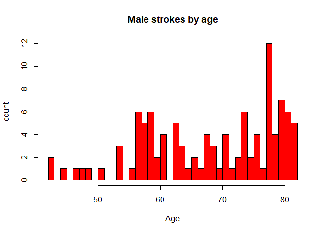

Brain stroke visualization in R
================
Jacob Hobbs (github:@xisurthros)
2022-08-31

## File setup

     Install and load packages
     Packages I load every time; uses "pacman"

``` r
rm(list=ls()) # Remove all variables previously stored
pacman::p_load(pacman, dplyr, GGally, ggplot2, ggthemes, ggvis, httr,
               lubridate, plotly, rio, rmarkdown, shiny, stringr, tidyr,
               psych, ggExtra)
library(datasets)
```

## Import data set

``` r
BrainStroke <- read.csv("Z:/Programming/R/BrainStroke/BrainStroke.csv")
head(BrainStroke)
```

    ##   gender age hypertension heart_disease ever_married     work_type
    ## 1   Male  67            0             1          Yes       Private
    ## 2   Male  80            0             1          Yes       Private
    ## 3 Female  49            0             0          Yes       Private
    ## 4 Female  79            1             0          Yes Self-employed
    ## 5   Male  81            0             0          Yes       Private
    ## 6   Male  74            1             1          Yes       Private
    ##   Residence_type avg_glucose_level  bmi  smoking_status stroke
    ## 1          Urban            228.69 36.6 formerly smoked      1
    ## 2          Rural            105.92 32.5    never smoked      1
    ## 3          Urban            171.23 34.4          smokes      1
    ## 4          Rural            174.12 24.0    never smoked      1
    ## 5          Urban            186.21 29.0 formerly smoked      1
    ## 6          Rural             70.09 27.4    never smoked      1

## Age and Gender distribution

``` r
ggplot(BrainStroke, aes(x=age, fill=gender)) +
  labs(title = "Age distribution | Stacked") +
  geom_histogram(bins=30)
```

<!-- -->

``` r
hist(BrainStroke$age [BrainStroke$gender == 'Male'],
     main = 'Male by age',
     ylab = 'count',
     xlab = 'Age',
     col = 'red',
     breaks = 30
     )
```

<!-- -->

``` r
hist(BrainStroke$age [BrainStroke$gender == 'Female'],
     main = 'Female by age',
     ylab = 'count',
     xlab = 'Age',
     col = 'blue',
     breaks = 30
     )
```

<!-- -->

## Age vs Strokes

``` r
ggplot(BrainStroke, aes(x=age, fill=stroke==1)) +
  labs(title = "Age vs Stroke | Stacked", fill = 'Stroke') +
  geom_histogram(bins=30)
```

<!-- -->

``` r
hist(BrainStroke$age [BrainStroke$stroke == 1 & BrainStroke$gender == 'Male'],
     main = 'Male strokes by age',
     ylab = 'count',
     xlab = 'Age',
     col = 'red',
     breaks = 30
     )
```

<!-- -->

``` r
hist(BrainStroke$age [BrainStroke$stroke == 1 & BrainStroke$gender == 'Female'],
     main = 'Female strokes by age',
     ylab = 'count',
     xlab = 'Age',
     col = 'blue',
     breaks = 30
     )
```

<!-- -->

## BMI vs Stroke

``` r
hist(BrainStroke$bmi [BrainStroke$stroke == 1 & BrainStroke$gender == 'Male'],
     main = 'Male',
     ylab = 'count',
     xlab = 'BMI',
     col = 'red',
     breaks = 30
     )
```

<!-- -->

``` r
hist(BrainStroke$bmi [BrainStroke$stroke == 1 & BrainStroke$gender == 'Female'],
     main = 'Female',
     ylab = 'count',
     xlab = 'BMI',
     col = 'blue',
     breaks = 30
     )
```

<!-- -->

## Glucose Level vs Stroke

``` r
hist(BrainStroke$avg_glucose_level [BrainStroke$stroke == 1 & BrainStroke$gender == 'Male'],
     main = 'Male',
     ylab = 'count',
     xlab = 'BMI',
     col = 'red',
     breaks = 30
     )
```

<!-- -->

``` r
hist(BrainStroke$avg_glucose_level [BrainStroke$stroke == 1 & BrainStroke$gender == 'Female'],
     main = 'Female',
     ylab = 'count',
     xlab = 'BMI',
     col = 'blue',
     breaks = 30
     )
```

<!-- -->

## BMI vs Avg Glucose Level

``` r
ggMarginal(ggplot(data = BrainStroke, mapping = aes(x = bmi, y = avg_glucose_level)) +
    geom_point(aes(color = gender)), type = "histogram", fill="pink")
```

<!-- -->

## Age vs BMI

``` r
ggplot(BrainStroke, aes(x=age, y=bmi)) + 
  geom_point(aes(col=bmi, size=age)) + 
  geom_smooth(method="loess", se=F) + 
  labs(subtitle="Age Vs BMI", 
       y="BMI", 
       x="Age", 
       title="Scatterplot", 
       )
```

    ## `geom_smooth()` using formula 'y ~ x'

<!-- -->

## Gender vs BMI

``` r
ggplot(BrainStroke, aes(x=bmi, fill=gender)) +
  labs(title = "Age vs BMI | Stacked") +
  geom_histogram(bins=30)
```

<!-- -->

``` r
hist(BrainStroke$bmi [BrainStroke$gender == 'Male'],
     main = 'Male',
     ylab = 'Count',
     xlab = 'BMI',
     col = 'red',
     breaks = 30
     )
```

<!-- -->

``` r
hist(BrainStroke$bmi [BrainStroke$gender == 'Female'],
     main = 'Female',
     ylab = 'Count',
     xlab = 'BMI',
     col = 'blue',
     breaks = 30
     )
```

<!-- -->
